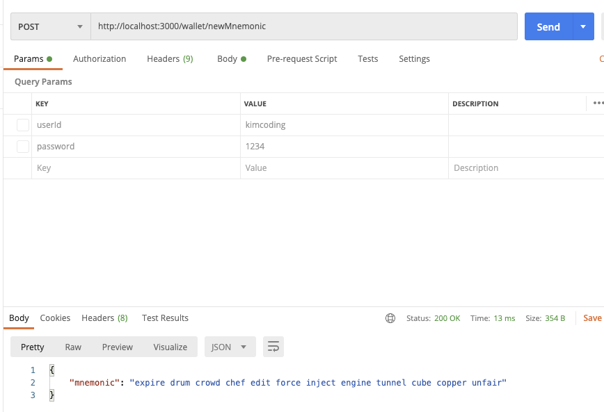
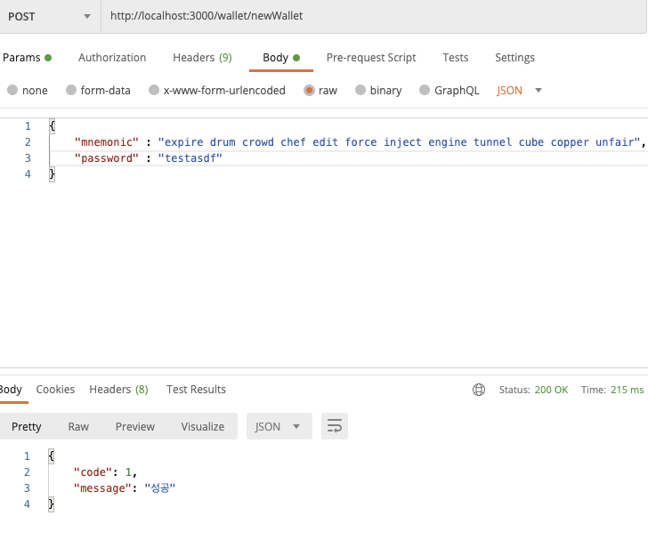

# Wallet

# 개발 목적
> 이더링무 지갑 개발

# 결과
1. 니모닉 생성

2. 니모닉과 비밀번호를 입력하여 지갑 생성

# 회고
## KEEP
+ 학습 했던 이더리움 지갑 개발 과정을 구현해 볼 수 있었다.

## problem
+ 자잘한 실수들이 있어 생각보다 시간이 걸렸다.

## Try
+ 지갑 1개로 다양한 메인넷의 지갑도 연동해보면 좋을 것같다.
+ 

